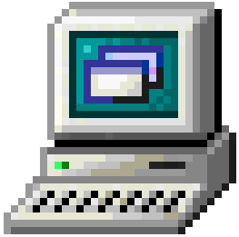
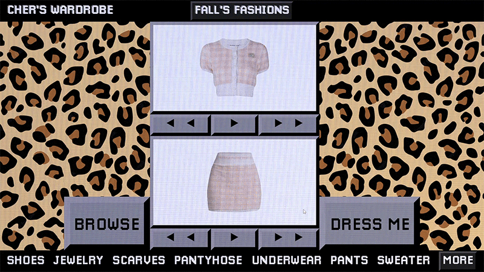

<!-- PROJECT LOGO -->
 

  

  <h3 align="center">Ugh, as if! | "Clueless" Cher's Wardrobe</h3>

  

    A simple implementation of grade-school classic “rock paper scissors”. Part of The Odin Project's JavaScript curriculum.
     
     
    <a href="https://praxeds.github.io/codepen-chers-closet/index.html">Live Demo</a>
    ·
    <a href="https://codepen.io/praxeds/pen/bGKrgWM">Codepen</a>

  

<!-- CONTACT -->
## Contact

Juliana Praxedes - contact@julianapraxedes.com

Project Link: [https://praxeds.github.io/codepen-chers-closet](https://praxeds.github.io/codepen-chers-closet)

(<a href="#top">back to top</a>)

<!-- Resources -->
## Resources

* Sound Effects by [Pixabay](https://pixabay.com/sound-effects)

(<a href="#top">back to top</a>)

